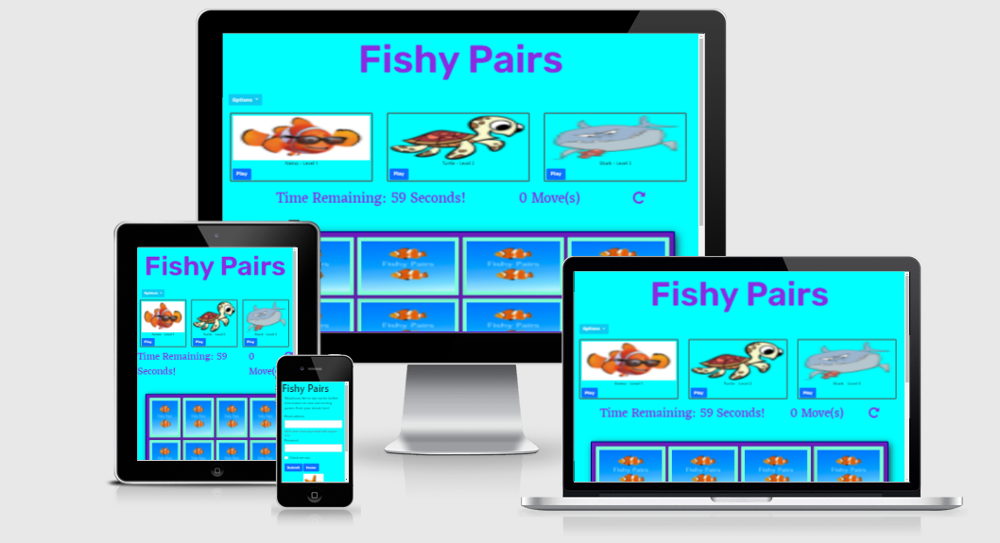
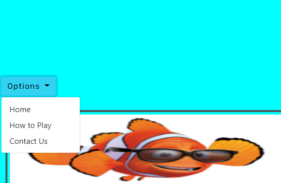

# Milestone Project 2 - Fishy Pairs Game

### Click here for a link to the live project on GitHub [Fishy Pairs](https://leah1977.github.io/Fishy_pair/)

This is a User Centric Frontend Development Project for Milestone 2.

The project features an interactive matching game.  Users can choose from three levels. 

The game is targeting individual game play for users to have fun and race against the clock to find the pairs before time runs out.

## Table of Contents.

1.  [Introduction](#introduction)
2.  [UX](#ux)
    - [Project-Goals](#project-goals)
    - [Strategy](#strategy)
    - [Scope](#scope)
    - [Skeleton](#skeleton)
    - [Features](#features)
    - [Design](#design)
3.  [Project-Display](#project-display)
4.  [Technologies](#technologies)
5.  [Testing](#testing)
6.  [Debugging](#testing)
7.  [Deployment](#deployment)
8.  [Acknowledgements](#acknowledgements)

## Introduction

## Welcome!

### This site was built using [GitHub Pages](https://pages.github.com/)/.

I have created a mobile first project

FISHY PAIRS

My project is all about having fun while reinforcing some early learning skills to improve the cognitive development of a young child.
Fish pairs is a memory game.  It is aimed to encourage children to improve their memory recall while having fun, while also learning some interesting fish facts.
The game will increase in difficulty as the child progresses through the levels.
There will be an option to take a quiz for bonus points on completion of each level.

### What value does it provide to its users
This game encourages the cognitive development of young children.
Improving memory skills.
It provides a fun platform  for learning.
The game is designed for short sessions of game play in which the child can interact with a game  while learning.
e.g.Have fun and enjoy playing the game, educational value, memory skills etc.

### What value does it provide to the site owner – enjoy playing the game myself with family. Two player option??
It is  a way to interact with young children and lead on to independent play as the child progresses.
The game can be enjoyed as an adult with a young child as  the fun creative element will promote engagement.

### Here is a demonstrating of how my website looks on different screensizes using [Am I Responsive Website](http://ami.responsivedesign.is/)

This should display different pages on different screen sizes.

---
#### This project will include four separate pages.  

* Home page
* How to play page with pop up feedback “well done” “better luck next time”
* Sign up Form
* 404 page which has a link back to the home page without using browser navigation.

## Home page
### The home page is made up of a header.  The header includes a button to enter game play.

### There is a navigational bar with working links.   This will appear the home page, the game play, sign up form and how to play section.

### The home page includes a button.  The button is responsive to encourage the customer to focus and engage with it.  The text box displays a Start button in blue to draw the customers eye again.

## How to Play Page

### The  How to Play  page has a list of clear instructions on how to play the game. 
 
* Choose a level
* Enter your name.
* Save your score.
* Cancel the game.
* Restart.

## Game section.
Once the player chooses a level, they are brought to the game section.  Here there will be a set number of cards displaying face down and of identical appearance.
There will be a timer at the top and a start button over the cards.
Once the player clicks on the start button the timer will start.  There will be a set time to play the game depending on difficulty level.
The player must choose two cards
 – 
if they match – there will be a response of well done, choose another two cards.
If they do not match the cards will return to face down and the player will be encouraged to try again.
If all the cards are matched before the time runs out the player will be congratulated.  If they are in the top 10 they will be asked to enter their initials on a leaderboard.
If some of the cards are left unmatched they will be encouraged to play again.

There will be an option to click on a winning pair to find out some information about the fish on the card.
At the end of the round there will be an optional choice question for bonus points.
If the player chooses correctly they will get an extra point.
If the player chooses incorrectly they will not get an extra point.
The player will then be asked if the they would like to play again or return to the home menu.
Include a screenshot of the game play here.

## Sign up Form

This page will allow the player to sign up for further information on updates for our game application.
Include a screenshot of the sign up form here.
You could include a link to the file page here for the form.

### The sign up form is to register with our site to be notified of further games or updates
.

### Contact and address information for the company.
## Features left to implement
I would like to include a section to become a member of our fish pairs club.

Game Level option choice.

I would have liked to include the options to have different difficulty levels.

## Design:

## UX

## Skeleton:
---

### I have used Balsamique to draw up 3 page wireframes for Mobile, iPad and Desktop.

### Click here for a link to the Wireframes 

## Project Goals.

### This project provides an interactive matching game.  Intended for enjoyment.

* To engage with the user for a set amount of time.
* To provide the user with three level options.
* To allow the user to enter their initials for the leaderboard top 10. 
* To allow the user to exit the game at any stage.
* To allow the user to restart the game.
* To allow the user to opt in or out for volume.

## Strategy
---

### This website is for users looking to interact with a matching game.	
* I want to provide a game with different levels.
* I want the instructions to be easy to follow.
* I want the user to navigate the site with ease.

* Would you find this game easy to understand?
* Would you like sound when playing?
* Would you like to see your score?
* Would you like to choose the timer length?
* Would you like to record your score?
* How long do you think you would like the game to last?

## User Story 1

### What I expect to find on a matching game?
 
1. I expect to be able to navigate around the game with ease.
2. I expect to be able to choose my level of play.
3. Since this is an interactive game, I expect to be able to click on a card and for the image to turn over to display a picture.  
4. Can I restart the game during play? I would like to be able to change levels, restart the game or quit at any stage.

## User Story 2

### As a website user, I want a game to challenge me.  I would expect to be able to choose my level of difficulty and for the game play to match the level.

### What I expect to find on a web application game.

1. Does it increase with difficulty as I progress throught the game?
2. Will the game congratulate me?
3. What do other customers say about them.

### With these user stories in mind, I put together some wireframes.  I included all the main requirements and issues that were raised from my user story research.

## Scope

### Essentials will include

*	Levels
*	Start button
*   Restart button
*	Exit button
*   Timer
*   Leaderboard
*   sound on/off selector
	you completed the game announcement/modal
## Features
---
#### This project will include four separate pages.  

* Home page
* How to play page with pop up feedback “well done” “better luck next time”
* Sign up Form

## Color Scheme

### I will use the colors in the main body, header and footer

My main color will be purple.  I will use variations of this color to add designs that stand out and appeal to the user.

I used [Coolers](http://www.coolers.co) to generate my colours for the project. I then used variations within the project.

## Typography

### I will use the following fonts throughout the website for consistency in style.

 * Eczar
 * Rubik
 * Sans Serif as a back up

## Additional Features

## Project Display
---

### This project is responsive to appear on different screen sizes.
### The display changes to accomodate smaller screensize. 
### This project is specifically designed to engage with the user.  Encouraging the user to interact with the game.
### This project will have specific responses depending on the users’ decisions and engagement.
### There will be a main navigation system and structured layout.

## Languages

* [HTML](http://wwww.html.com) Used for all four html pages as the main markup language for this project.
* [CSS](http://www.css-tricks.com) Used to style the content of my website.
* [JavaScript](http://www.javascript.com).

## Technologies

Code used throughout this project was learned and implemented from the [Code Institute Diploma Programme](https://codeinstitue.net)

In this project, I used the following to help build my website.

* [Font Awesome](https://stackpath.bootstrapcdn.com/font-awesome/4.7.0/css/font-awesome.min.css) for all the great icons.

* [Google Fonts](https://fonts.googleapis.com/css2?)

* [Bootstrap](https://stackpath.bootstrapcdn.com/bootstrap/4.5.2/css/bootstrap.min.css) throughout this project.

* [Balsamique](https://balsamiq.com/)
  
* [hover.css](https://cdnjs.cloudflare.com/ajax/libs/hover.css/2.1.1/css/hover-min.css).

I used the code from bootstrap for my header.  Here I added a logo and company name.  
I also edited the css styling to suit my website and adjusted the layout to size appropriately.

* [html](www.html.com)
* [css] (www.css.co)
* [JavaScrip](www.javascript.com)
---

### Code used throughout this project was learned and implimented from the [Code Institute Diploma Programme](https://codeinstitue.net)

### In this project I used the following to help build my website.

### In this project I have used [Font Awesome](https://stackpath.bootstrapcdn.com/font-awesome/4.7.0/css/font-awesome.min.css) for all the great icons.

### In this project I have used [Google Fonts](https://fonts.googleapis.com/css2?)

### I have used [Bootstrap](https://stackpath.bootstrapcdn.com/bootstrap/4.5.2/css/bootstrap.min.css) throughtout this project.

  
### I have used [hover.css](https://cdnjs.cloudflare.com/ajax/libs/hover.css/2.1.1/css/hover-min.css).

### google maps link from www.google.com. ("https://www.google.com/maps/embed")

### Thanks to all the photograhpers and websites Unsplash, Pexels and Pixabay for allowing the use of following photos and video.

## Further References
- Confident Coding by Rob Percival
- Confident Web design by Kenny Wood
- Patreon 
- [YouTube](https://www.youtube.com/) 
- [W3Schools](https://www.w3schools.com/) used for information to help in css styling
- [AmIResponsive](http://ami.responsivedesign.is/)

## Deployment

I used the programme [Gitpod](www.gitpod.io) in the development of this project.  I pushed it to GitHub using the CLI, which is built into Gitpod.

### To deploy this project to GitHub from its Gitpod repository - please follow these steps.

1. Log in to http://www.github.com
2. Click on "Your Repositories" from the dropdown menu and select LSH_Electricians_MS1.
3. Go to the list of options and select Settings.
4. Scroll down to GitHub pages.
5. Under source, click the drop-down menu and select branch: master.
6. Your page then refreshes, and your site is deployed.
7. Scroll back down to GitHub pages, and you are now provided with a link to your deployed website.

### To clone this project into Gitpod, you should follow these steps.

1. Open your Github account or create one.
2. Use the Chrome browser.
3. Install the extension for Gitpod.
4. Log into your gitpod account.
5. Navigate to the Project GitHub repository.
6. Under the Repository LSH_Electricians_MS1, click download.
7. This will trigger a new gitpod workspace that you can work on.

## Acknowledgements

Much thanks to my mentor Nishant Kumar for giving great support and encouragement throughout my first Milestone Project.

Much thanks to Code Institute Tutors for pointing me in the right direction when I was going off course.

Thanks also to support from the Slack Community. 

Thanks also to the support of my husband and family supporting me through this project and providing invaluable feedback.

