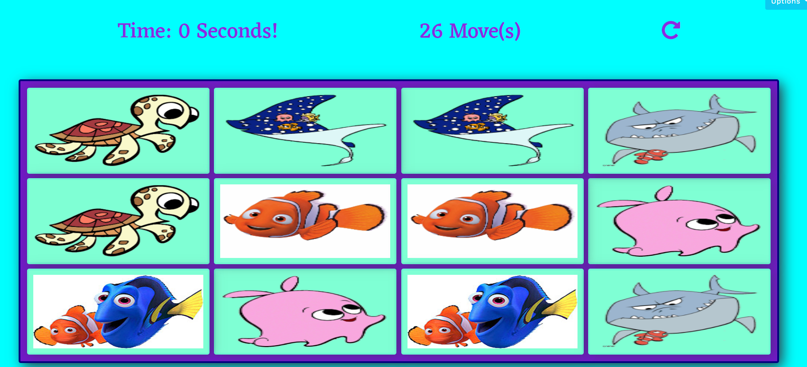
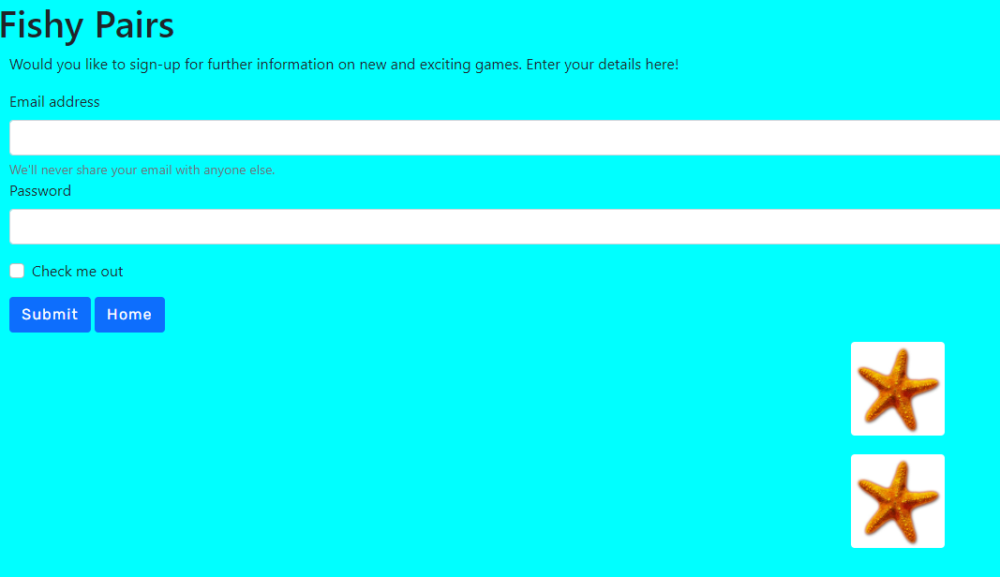
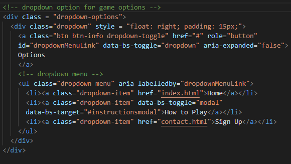

# Milestone Project 2 - Fishy Pairs Game

### Click here for a link to the live project on GitHub [Fishy Pairs](https://leah1977.github.io/Fishy_pair/)

A User-Centric Frontend Development Project for Milestone 2.

The project features an interactive matching game. 

The game targets individual gameplay for users to have fun and race against the clock to find the pairs before time runs out.

## Table of Contents.

1.  [Introduction](#introduction)
2.  [UX](#ux)
    - [Project-Goals](#project-goals)
    - [Strategy](#strategy)
    - [Scope](#scope)
    - [Skeleton](#skeleton)
    - [Features](#features)
    - [Design](#design)
3.  [Project-Display](#project-display)
4.  [Technologies](#technologies)
5.  [Testing](#testing)
6.  [Debugging](#testing)
7.  [Deployment](#deployment)
8.  [Acknowledgements](#acknowledgements)

## Introduction

## Welcome!

### This site was built using [GitHub Pages](https://pages.github.com/)/.

I have created a mobile-first project.

FISHY PAIRS

My project is all about having fun while reinforcing some early learning skills to improve the cognitive development of a young child.
Fish pairs is a memory game.  It is aimed to encourage children to improve their memory recall while having fun.
The game will increase in difficulty as the child progresses through the levels.

### What value does it provide to its users
This game encourages the cognitive development of young children.
We are improving our memory skills.
It provides a fun platform for learning.
The game is designed for short sessions of gameplay in which the child can interact with a game while learning.

### What value does it provide to the site owner – I enjoy playing the game myself with family.
It is a way to interact with young children and lead to independent play as the child progresses.
The game can be enjoyed as an adult with a young child as fun. The creative element will promote engagement.

### Here is a demonstrating of how my website looks on different screen sizes using [Am I Responsive Website](http://ami.responsivedesign.is/)

The game will resize according to the different screen sizes.

---
#### This project will include four separate pages.  

* Home page with the game
* How to play page with pop up feedback “well done” “better luck next time.”
* Sign up Form
* 404 page, which has a link back to the home page without using browser navigation.

## Home page
 
The home page is made up of the title “Fishy Pairs”.
There is an overlay to start the game.
The matching game.
There is a drop-down, select menu.

The home page displays an overlay that is clicked to start the game.  

## How to Play Page

The  How to Play page has a list of clear instructions on how to play the game. 
There is also a close button to close the modal and a link back to the home page to play the game.

## Game section.

- The player will click on the play button to enter the game.

- Here, there will be a set number of cards displaying face down and of identical appearance.

- There will be a timer at the top, a moves counter and a refresh icon over the cards.

- Once the player clicks on the start button, the timer will start.  There will be a set time to play the game.

- The player must choose two cards

  - If they match – the cards will remain open, and the player may continue to choose another two cards.

  

  - If they do not match, the cards will return to a face down, and the player may try again.
  

  - If the time runs out before all the cards are matched, a “Hard Luck” pop up will show.
  

  - If all the cards are matched before the time runs out, the player will be congratulated. 
   
  

## Sign up Form

This page will allow the player to sign up for further information on updates for our game application.

The sign-up form is to register with our site to be notified of other games or updates.

## Features left to implement
I would like to include a section to become a member of our fish pairs club.

As I develop and improve my JavaScript skills, I would like to include options to change the game’s difficulty level.

# UX

## Skeleton:

### I have used Balsamique to draw up 3-page wireframes for Mobile, iPad and Desktop.

### Click here for a link to the Wireframes [Balsamique Fishy_Pairs](assets/wireframes/game_wireframe.pdf)

## Project Goals.

### This project provides an interactive matching game. They are intended for enjoyment.

* To engage with the user for a set amount of time.
* To allow the user to exit the game at any stage.
* To allow the user to restart the game.

## Strategy

### This website is for users looking to interact with a matching game. 
* I want to provide a fun and enjoyable game for a young child.
* I want the instructions to be easy to follow.
* I want the user to navigate the site with ease.

* Would you find this game easy to understand?
* Would you like sound when playing?
* Would you like to see your score?
* Would you like to choose the timer length?
* Would you like to record your score?
* How long do you think you would like the game to last?

## User Story 1

### What I expect to find on a matching game?
 
1. I expect to be able to navigate around the game with ease.
2. I expect to be able to choose my level of play.
3. Since this is an interactive game, I expect to click on a card and for the image to turn over to display a picture.  
4. Can I restart the game during play? I want to be able to change levels, continue the game or quit at any stage.

## User Story 2

 As a website user, I want a game to challenge me.  I would expect to choose my level of difficulty and for the gameplay to match the level.

### What I expect to find on a web application game.

1. Does it increase with difficulty as I progress through the game?
2. Will the game congratulate me?
3. What do other customers say about them?

## User Story 3

### Would this game be suitable for an older child.

1. Is the game rewarding?
2. Will the game keep me interested?
3. What age is the game intended for?

As a user, I would like to challenge myself and see a record of my previous scores.

## User Story 4

### Would this game be suitable to play with a young child?

1. Is the game easy to navigate?
2. Is it a quick game?
3. Are there educational advantages to playing this game?

As a user, I would like to play this game with my son/daughter.  I would like them to be able to engage with the game.
I want the game to help with their memory skills.

With these user stories in mind, I put together some wireframes.  I included all the primary requirements and issues that were raised from my user story research.

## Scope

### Essentials will include

* Restart button
* Exit button
* Timer
* you completed the game announcement/modal

## Features

#### This project will include four separate pages.  

* Home page
* How to play page with pop up feedback “well done”, “better luck next time.”
* Sign up Form

## Color Scheme

### I will use the colours in the main body, header and footer

My primary colours will be blue-violet and aqua.  I will use variations of this colour to add designs that stand out and appeal to the user.

I used [Coolers](http://www.coolers.co) to generate my colours for the project. I then used variations within the project.

## Typography

### I will use the following fonts throughout the website for consistency in style.

 * Eczar

I chose this font style to catch the attention of the user when the game loads

 

 * Rubik

 

 I chose this for the main game title.

 
 
 * Sans Serif as a back up

## Additional Features

## Project Display

This project is responsive to appear on different screen sizes.
The display changes to accommodate smaller screen sizes. 
This project is specifically designed to engage with the user. We are encouraging the user to interact with the game.
This project will have specific responses depending on the users’ decisions and engagement.
There will be the main navigation system and structured layout.

## Languages

* [HTML](http://wwww.html.com) Used for all four HTML pages as the main markup language for this project.
* [CSS](http://www.css-tricks.com) Used to style the content of my website.
* [JavaScript](http://www.javascript.com).

## Technologies

In this project, I used the following to help build my website.

* [Font Awesome](https://stackpath.bootstrapcdn.com/font-awesome/4.7.0/css/font-awesome.min.css) for all the great icons.

* [Google Fonts](https://fonts.googleapis.com/css2?)

* [Bootstrap](https://stackpath.bootstrapcdn.com/bootstrap/4.5.2/css/bootstrap.min.css) throughout this project.

* [Balsamique](https://balsamiq.com/)
  
* [hover.css](https://cdnjs.cloudflare.com/ajax/libs/hover.css/2.1.1/css/hover-min.css).

* [html](www.html.com)
* [css] (www.css.co)
* [JavaScript](www.javascript.com)
---

## In this project, I used the following to help build my website.

Code used throughout this project was learned and implemented from the [Code Institute Diploma Programme](https://codeinstitue.net)

### [Font Awesome](https://stackpath.bootstrapcdn.com/font-awesome/4.7.0/css/font-awesome.min.css) for its excellent choice of icons.

### [Google Fonts](https://fonts.googleapis.com/css2?)

### [Bootstrap](https://cdn.jsdelivr.net/npm/bootstrap@5.0.0-beta2/dist/js/bootstrap.bundle.min.js) throughtout this project.

    
### I have used [hover.css](https://cdnjs.cloudflare.com/ajax/libs/hover.css/2.1.1/css/hover-min.css).

### Images

Images for this game were located in the clipart-library

[Card Images](http://clipart-library.com/nemo.html)

JavaScript code was coded with the help of 

YouTube
https://scotch.io/tutorials/how-to-build-a-memory-matching-game-in-javascript#toc-3-moves

## Further References
- Confident Coding by Rob Percival
- Confident Web design by Kenny Wood
- Patreon 
- [YouTube](https://www.youtube.com/) 
- [W3Schools](https://www.w3schools.com/) used for information to help in css styling
- [AmIResponsive](http://ami.responsivedesign.is/)

## Testing

[Testing Section](TESTING.md)

## Deployment

I used the programme [Gitpod](www.gitpod.io) in the development of this project.  I pushed it to GitHub using the CLI, which is built into Gitpod.

### To deploy this project to GitHub from its Gitpod repository - please follow these steps.

1. Log in to http://www.github.com
2. Click on “Your Repositories” from the drop-down menu and select Fishy_pair.
3. Go to the list of options and select Settings.
4. Scroll down to GitHub pages and click on the new dedicated tab.
5. Under source, click the drop-down menu and select branch: master.
6. Your page then refreshes, and your site is deployed.
7. Scroll back down to GitHub pages, and you are now provided with a link to your deployed website.

### To clone this project into Gitpod, you should follow these steps.

1. Open your Github account or create one.
2. Use the Chrome browser.
3. Install the extension for Gitpod.
4. Log into your gitpod account.
5. Navigate to the Project GitHub repository.
6. Under the Repository Fishy_pair, click download.
7. This will trigger a new gitpod workspace that you can work on.

## Acknowledgements

Much thanks to my mentor Nishant Kumar for giving great support and encouragement throughout my second Milestone Project.

Much thanks to Code Institute Tutors for pointing me in the right direction when I was going off course.

Thanks also to support from the Slack Community. 

Thanks also to my husband and family for supporting me through this project and providing invaluable feedback.

### End of README

[Return to Table of Contents](#table-of-contents)
