# Testing Of Milestone Project 2

## Table of Contents.

1.  [CSS Validation](#css-validator)
2.  [HTML Validation](#html-validator)
3.  [JS Validation](#js-validator)
4.  [Wireframe Comparison](#wireframe)
5.  [Lighthouse](#lighthouse)
6.  [Mobile](#mobile-testing)
7.  [Project Testing](#deployed-testing)
    - [Links](#links)
    - [Overlay](#overlay)
    - [Modal](#modal)
    - [Sign-up Form](#form)
8.  [User Stories](#user-stories)
    - [User Story 1](#user-story-1)
    - [User Story 2](#user-story-2)
    - [User Story 3](#user-story-3)
    - [User Story 4](#user-story-4)
9.  [Debugging](#debugging)


[Back to README.md](README.md)

## CSS Validator

Tested on W3C CSS Validator

<p>
    <a href="http://jigsaw.w3.org/css-validator/check/referer">
        
    </a>
</p>

[CSS Validation for https://github.com/Leah1977/Fishy_pair](https://jigsaw.w3.org/css-validator/validator?uri=https%3A%2F%2Fleah1977.github.io%2FLSH_Electricians_MS1%2F&profile=css3svg&usermedium=all&warning=1&vextwarning=&lang=en)

## HTML Validator

Pass code throught HTML Validator

[https://leah1977.github.io/Fishy_pair/](https://validator.w3.org/nu/?doc=https%3A%2F%2Fleah1977.github.io%2FFishy_pair%2F)


[index.html W3C Markup Validation https://leah1977.github.io/index.html](https://validator.w3.org/nu/?doc=https%3A%2F%2Fleah1977.github.io%2FFishy_pair%2Findex.html)

[contact.html W3C Markup Validation https://leah1977.github.io/contact.html](https://validator.w3.org/nu/?doc=https%3A%2F%2Fleah1977.github.io%2FFishy_pair%2Fcontact.html)

[404.html  W3C Markup Validation https://leah1977.github.io/contact.html](https://validator.w3.org/nu/?doc=https%3A%2F%2Fleah1977.github.io%2FFishy_pair%2F404.html)

## JS Validator

Tested the site with jshint.com validator.

## Wireframe Comparison

Comparing the deployed version against the development version(wireframes)

- Changes to the finished version of my game.

I removed the three dificulty options from the finished game.

I removed this because, I found I was confusing myself with all the new JavaScript.
I decided to concentrate on the core basics of the game and to build on it as much as I could within the given timeframe.

As a result the game is very basic, but I found it was clear and simple.  Making it ideal for the intended user.

There is no leadership board in the finished game and I hope to learn how to incorporate this at a later stage, as my knowledge grows.

## Lighthouse

Tested the site using Lighthouse 

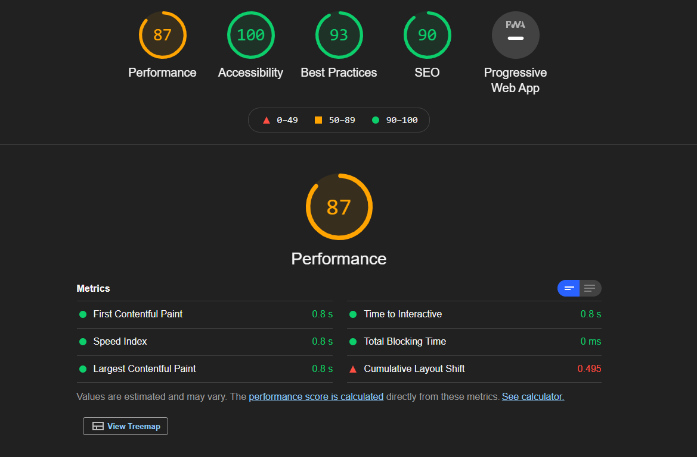

## Mobile

Tested the site for mobile friendly usage

[Mobile-Friendly Test-Google Services](https://search.google.com/test/mobile-friendly)
![Mobile friendly approved]assets/images/readmeimages/mobilefriendly.png)

## Project Testing

### Links

Tested all links on all pages. All links work as intended. This allows the user to move from one page to another with ease.


**Expected**

When you click on the options dropdown menu item, it is expected to drop down with a list of items that you can click on.
* The first link returns you to the game.
* The second link leads to a modal that instructs you on how to play the game.
* The third option is to bring you to a form to sign up for further information.


**Testing**

Clicked on drop-down menu.
Clicked on each option.

**Result**

When you click on  Home, you are returned to the home page.
When you click on How to Play, a modal pops up with instructions on How To Play.
When you click on Sign up, you are redirected to a sign up page.

**Expected**
The links work as expected.

Tested the overlay

**Expected**

Tested the social contact links in the footer

Tested the social contact links on all pages. Clicking on a social link, link should change colour when you hover over it and, when clicked, will redirect you to the relevant page in a new window.

**Expected**

When you hover over the social link, it is expected that the link will change colour. When you click on the social link you will be redirected to the relevant page in a new window.

**Testing**

Tested the social link on each page by clicking on the social links.

**Result**

The site acted as expected, and the link changed colour when you hover over it and redirects you to a new page when you click on it.

**Fix**

No fix required.

### Overlay

When you click on the overlay, it will hide from view.  
Allowing you to start the game.

### Tested the modal

Tested the modal on the home page. 

**Expected**

A modal will pop up on the home page.

**Testing**

The modal pops up with an option to click on play game or close modal.

**Result**

Links work as expected.

**Fix**

No fix required.

### Sign-up Form

Tested the form. Entered in details to each relevant section.
I checked the submit button by clicking on it.
Click on the Home Button to return to the game.

**Expected**

When you enter in your details, they are displayed as entered.
When you click on the submit button, the form is submitted - this site is static.
When you click on the Home button, you are returned to the game.

**Testing**

Tested the form by filling out details for all sections.

**Result**

If you leave enter the email address in incorrect format, a pop up appears to prompt you to fill out your details.

Testing across various devices

- Ensured the website was responsive on all pages through [Google Mobile Friendly](https://search.google.com/test/mobile-friendly)

- Ensured the website was responsive on different mobiles using [BrowserStack](https://www.browserstack.com/)
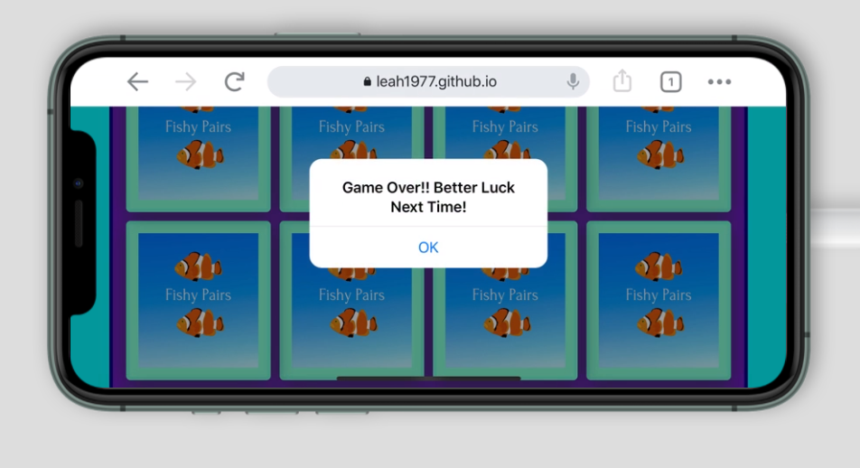

- Testing was also performed on Safari and Chrome

- Testing was also carried out by several family members.


## User Stories

Implement the user stories.

### User Story 1

What I expect to find on a matching game?
 
1. The game displays an overlay to click on to start the game straight away.
2. The game gives three options.  You can choose to play straight away.  You can click on an option to find out how to play the game.  You can sign up for further information on developing games.
3. The game is interactive.  When you click on a card it will turn over.  If you find a match it will remain flipped, you can then continue to choose another card.  
   Continue play till all the matches are found.  
   Your score will be counted up as moves for each click.
   You will play till the timer runs out.
4. You can restart the game at any stage with the restart icon.
   There are no further levels at this stage.  There are plans to have more levels.

   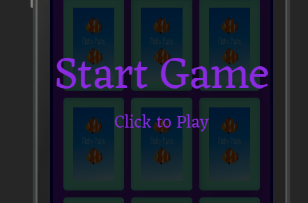

### User Story 2

 This game has one level, you will race against the clock to find all the matches.


1. As you try and find the matches, the time decreases.  You must find all the matches before the game ends to win.
2. The game will congratulate you if you win.
   The game will also have a Hard Luck message at the end if you do not win.

### User Story 3

This game can be played by an any age, but is designed to be used by a young child.

1. The game is made with bright coloured fun images to interest a young child.
2. the game is for short game play, to keep the interest of a younger child.
3. I would recommend this game for 3 - 6 year olds.

### User Story 4

This game would be suitable to play with a young child.

1. The game is easy to navigate.
2. It is designed for short game play to keep interest.
3. This game is great for promoting memory skills.  
   It also encourages developmental skills such as hand eye co-ordination.

## Debugging


Debugging HTML in index.html


### Dropdown menu not working 

I had added some extra bootstrap links to the bottom of the index.html page.  They were unneccessary as I had already add the bundle.  
This caused some doubling up.

With some help from Kevin in tutor support, I removed the unneccesary links


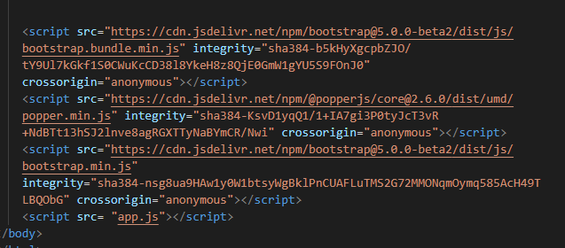


### Gameboard was misaligning

I had a positioning issue with my gameboard.  The cards were aligning too far to the left.
I adjusted my display in css to relative instead of absolute.  
This helped with the positioning.

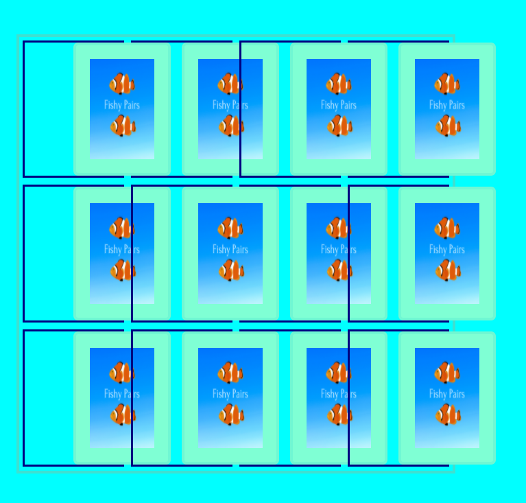
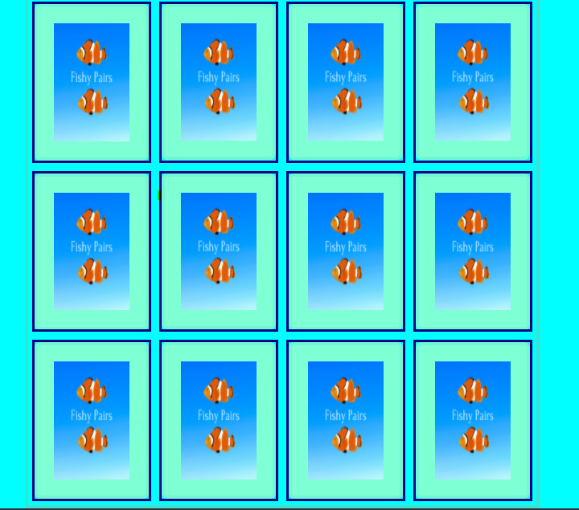

### Level choices not displaying inline across the width of the screen

Solved this issued with some 

```<section class ="level-options">
      <!-- level 1 Easy --> 
      <div class ="level-option1">
          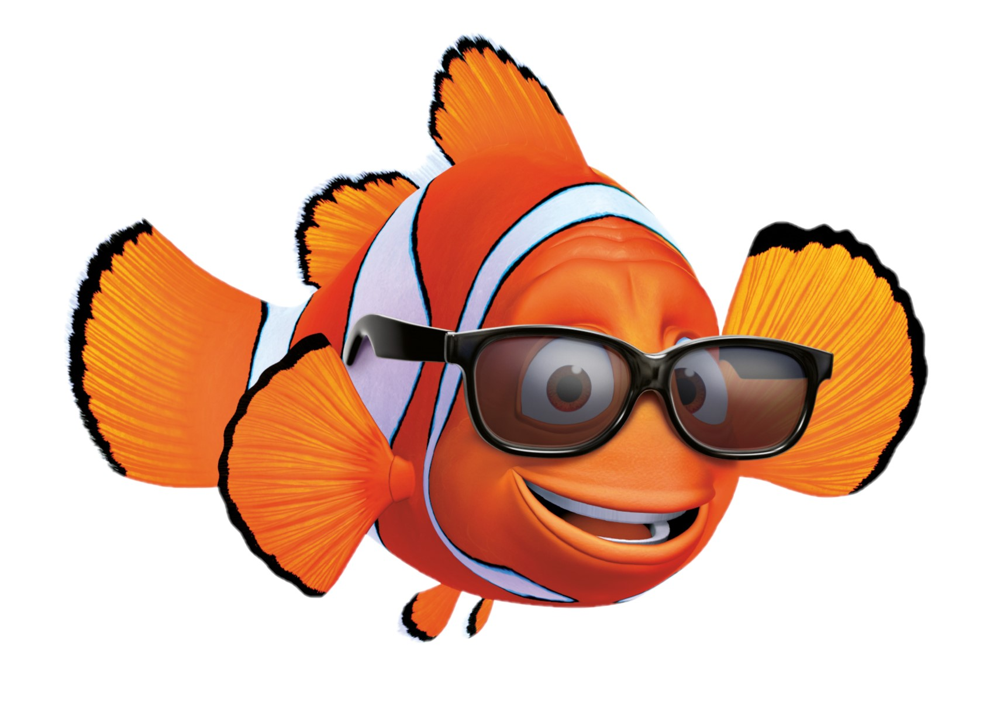
          <h5 class="card-title">Nemo - Level 1</h5>
          <button data-type="submit" class="btn btn-primary play-btn" onclick="window.location.reload()">Play</a>
      </div>
            
      <!-- level 2 Medium -->
      <div class="level-option2">
          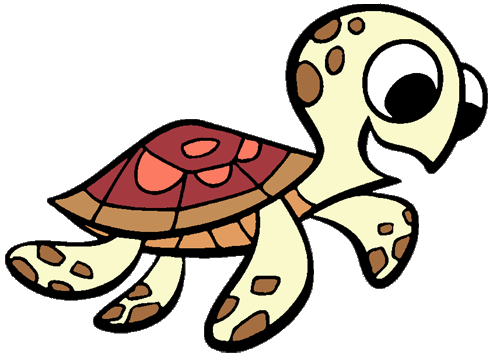
          <h5 class="card-title">Turtle - Level 2</h5>
          <button data-type="submit" class="btn btn-primary play-btn" onclick="window.location.reload()">Play</a>
      </div>
            
      <!-- level 3 Difficult -->
      <div class="level-option3">
          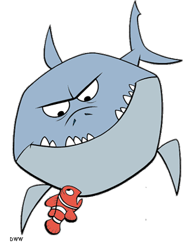
          <h5 class="card-title">Shark - Level 3</h5>
          <button data-type="submit" class="btn btn-primary play-btn" onclick="window.location.reload()">Play</a>
      </div>
    </section>

```

Decided later to delete this section due to lack of knowledge on JS for difficulty levels.

### Glyphicon not appearing in button

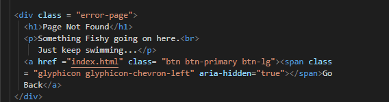

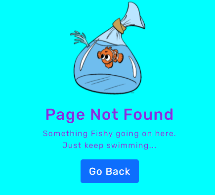

After googling and contacting tutor support, I learned that glyphicons are not supported in Bootstrap 5.0.
Therefore I changed to Font Awesome.

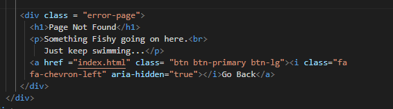

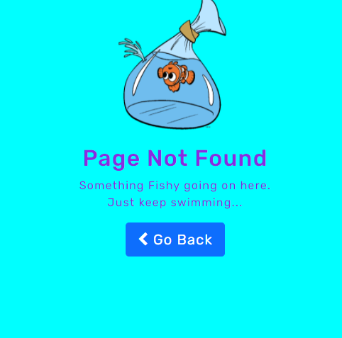

Jellyfish cards were matching but was not been recognised as a match.

Solution - The alt tag descriptions were not equal.

Updated the alt tag on the jellyfish img to match.


### Debugging on the 404.html

Image was appearing off center on the top of the page.

To fix this, I edited the css in the style.css file.

``` .fishy {
    width: 200px;
    padding: 20px;
    margin-left: auto;
    margin-right: auto;
    display: block;
}
```

## End of Testing Section

[Return to Table of Contents](#table-of-contents)