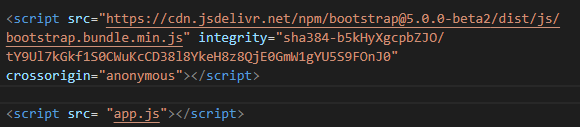

## Testing

[Back to README.md](README.md)

## Dropdown menu not working 

I had added some extra bootstrap links to the bottom of the index.html page.  They were unneccessary as I had already add the bundle.  
This caused some doubling up.

With some help from Kevin in tutor support, I removed the unneccesary links





## Gameboard was misaligning

I had a positioning issue with my gameboard.  The cards were aligning too far to the left.
I adjusted my display in css to relative instead of absolute.  
This helped with the positioning.


## Level choices not displaying inline across the width of the screen

## Glyphicon not appearing in button


After googling and contacting tutor support, I learned that glyphicons are not supported in Bootstrap 5.0.
Therefore I changed to Font Awesome.


## Jellyfish cards were matching but was not been recognised as a match.

Solution - The alt tag descriptions were not equal.

Updated the alt tag on the jellyfish img to match.


## CSS Validator

```<p>
    <a href="http://jigsaw.w3.org/css-validator/check/referer">
        
    </a>
</p>```
        

## HTML Valiator

Pass code throught HTML Validator

[https://leah1977.github.io/Fishy_pair/](https://validator.w3.org/nu/?doc=https%3A%2F%2Fleah1977.github.io%2FFishy_pair%2F)

<!-- Testing Section (write as separate file to readme but include link in readme.)
1.	Testing at development stage
•	Functionality testing
•	Usability testing
•	Responsiveness testing 
Add screen shots that match each user story when testing.
Test the deployed version against the development version(wireframes)
-	Are there changes?
-	Why did you change it?
-	Reasons for change?
-	How do you feel it has improved after the change.

Document the results of the testing.
You should have a well planned manual testing procedure to assess the website’s functionality, usability and responsiveness.

2.	Testing at implementation stage.


3.	Testing at deployment stage.

Make sure all links work and that there is no commented out code in the project.

When writing the README.md be sure to update the commits linked to it to give clear evidence of the  full development cycle.

Run the readme through grammarly before submitting project.

## Testing
## Tested the site using Lighthouse 


 ## Validator Testing


## Tested HTML

- [index.html W3C Markup Validation https://leah1977.github.io/1/index.html](https://validator.w3.org/nu/?doc=https%3A%2F%2Fleah1977.github.io%2FLSH_Electricians_MS1%2Findex.html)

- [services.html W3C Markup Validation https://leah1977.github.io/.html](https://validator.w3.org/nu/?doc=https%3A%2F%2Fleah1977.github.io%2FLSH_Electricians_MS1%2Fservices.html)


- [gallery.html W3C Markup Validation https://leah1977.github.io//gallery.html](https://validator.w3.org/nu/?doc=https%3A%2F%2Fleah1977.github.io%2FLSH_Electricians_MS1%2Fgallery.html)


## Tested on W3C CSS Validator


* [CSS Validation for https://github.com/Leah1977/](https://jigsaw.w3.org/css-validator/validator?uri=https%3A%2F%2Fleah1977.github.io%2FLSH_Electricians_MS1%2F&profile=css3svg&usermedium=all&warning=1&vextwarning=&lang=en)

<p>
    <a href="http://jigsaw.w3.org/css-validator/check/referer">
        
    </a>
</p>

## Tested the site with jshint.com validator.

## Tested the site for mobile friendly usage

[Mobile-Friendly Test-Google Services](https://search.google.com/test/mobile-friendly)


## Tested the site with jasmine testing.


Tested all links on all pages. All links work as intended. This allows the user to move from one page to another with ease.


**Expected**

When you click on the home dropdown menu item, it is expected to drop down with a list of items that you can click on.
* The first link returns you to the game.
* The second link leads to a modal that instructs you on how to play the game.
* The third option is to bring you to a form to sign up for further information.


**Testing**


**Result**


**Expected**


**Testing**


**Result**


**Expected**


**Testing**

**Result**


**Expected**


**Testing**


**Result**


**Fix**


## Tested the social contact links in the footer

Tested the social contact links on all pages. Clicking on a social link, link should change colour when you hover over it and, when clicked, will redirect you to the relevant page in a new window.

**Expected**

When you hover over the social link, it is expected that the link will change colour. When you click on the social link you will be redirected to the relevant page in a new window.

**Testing**

Tested the social link on each page by clicking on the social links.

**Result**

The site acted as expected, and the link changed colour when you hover over it and redirects you to a new page when you click on it.

**Fix**

No fix required.

## Tested the modal

Tested the modal on the home page. 

**Expected**


**Testing**


**Result**


**Fix**

No fix required.

## Tested the form on the contact page.

Tested the form. Entered in details to each relevant section.
I checked the submit button by clicking on it.
Click on the Clear Form button to clear the form.

**Expected**

When you enter in your details, they are displayed as entered.
When you click on the submit button, the form is submitted - this site is static.
When you click on the clear form button, the form clears.

**Testing**

Tested the form by filling out details for all sections.

**Result**


**Fix**

Amend media query for iPad so that the form appears in the center.

## Testing across various devices

- Ensured the website was responsive on all pages through [Google Mobile Friendly](https://search.google.com/test/mobile-friendly)

- Ensured the website was responsive on different mobiles using [BrowserStack](https://www.browserstack.com/)

- Testing was also performed on Safari and Chrome

- Testing was also carried out by several family members.


Implement the user stories.

### User Story 1

* 


### User Story 2

* 

### User Story 3


##  Debugging


###     Debugging HTML in index.html


```

```

T

### Debugging HTML in contact.html


## Debugging on the 404.html

 
``` 
.center-form {
        
    min-height: 240px;
    margin: 10px auto;
    max-width: 70%;
  } 
  ```


## Unfixed bugs.

Mention any unfixed bugs here and why they were not fixed.  
Time would be a big variable to consider here it is not a valid reason to leave a bug unfixed.
